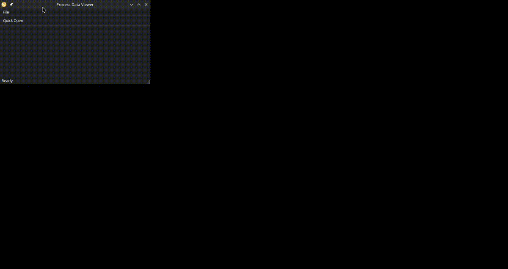
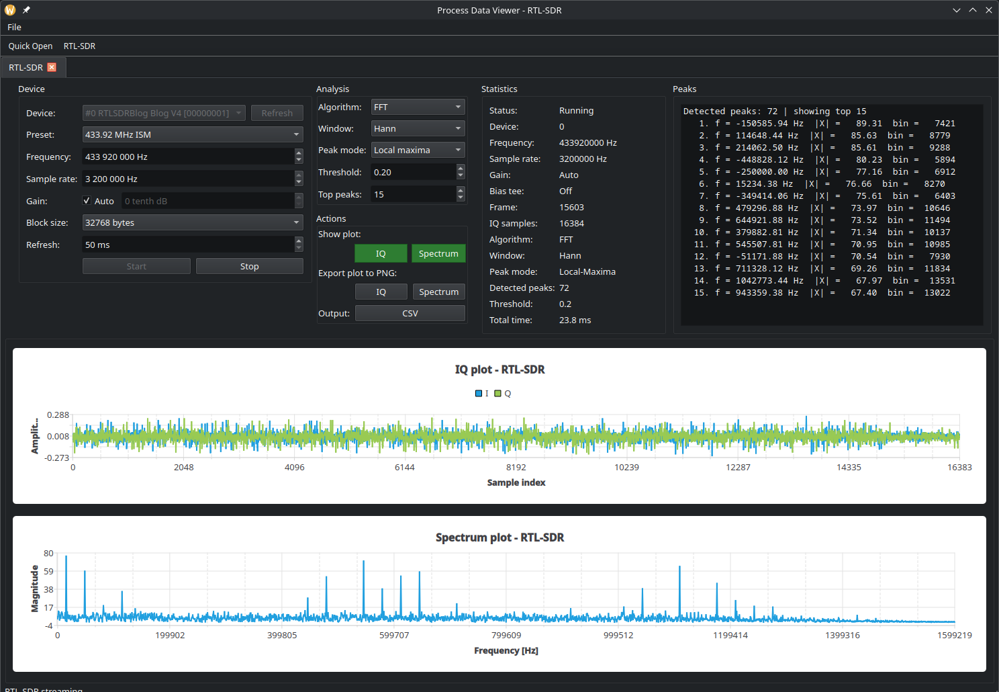

# Process Data Viewer (Qt)


Desktop application for interactive analysis of CSV time-series data, WAV signals, and live RTL-SDR IQ streams.

Built with Qt 6 (Widgets + Charts + Concurrent) and powered by a custom C++ library:
👉 https://github.com/r-lapins/Process-Data-Toolkit

---

## Features

### CSV Analysis
- Filtering: sensor / time range
- Anomaly detection: Z-score, IQR, MAD
- Statistics: min / max / mean / stddev
- Table + plot with anomaly markers
- Export: JSON, CSV, PNG

### WAV Analysis
- Backend: CPU (DFT/FFT) / GPU (cuFFT)
- FFT sizes:
- recommended (power-of-two)
- advanced (cuFFT optimized)
- Windowing: Hann / Hamming / None
- Peak detection: local maxima / threshold
- Plots: signal + spectrum
- Export: PNG, CSV, report

### RTL-SDR Analysis
- Live RTL-SDR device streaming
- Frequency presets: FM broadcast, airband, NOAA, ISM 433.92 MHz, ADS-B
- Configurable frequency, sample rate, gain, block size, refresh interval
- Live IQ plot and spectrum plot
- FFT / optional cuFFT backend
- Windowing: Hann / Hamming / None
- Peak detection: local maxima / threshold
- Export: PNG, CSV

---

## Demo

### CSV Analysis


### WAV Analysis


### RTL-SDR Analysis


---

### UX / Performance
- Async execution (QtConcurrent)
- Non-blocking UI
- Cached analysis via WavAnalysisSession

---

### Why this separation?

The project is intentionally split into:

- **PDT (library)** → reusable, testable, CLI-capable core
- **PDV (this app)** → interactive Qt UI on top of the library

This design:
- enforces clean architecture
- enables reuse outside GUI applications
- improves testability and maintainability

---

## Architecture

The application is split into three layers:

```text
PDV (Qt UI)
├── core/
├── csv/
├── wav//
├── rtlsdr/
└── PDT
    ├── io/
    ├── dsp/
    ├── compute/
    ├── pipeline/
    └── csv/
```

- UI → controllers → PDT
- no computation in Qt layer
- reusable backend (CLI + GUI)

---

### Build

```bash
git clone https://github.com/r-lapins/Process-Data-Viewer-Qt/
cd process_data_viewer_qt

git submodule update --init --recursive

cmake --preset debug
cmake --build --preset debug
```

**CUDA:**

```bash
cmake --preset debug-cuda
cmake --build --preset debug-cuda
```

Run:

```bash
./process_data_viewer
```

**RTL-SDR support requires librtlsdr development files.**

Fedora:
```bash
sudo dnf install rtl-sdr-devel
```

Ubuntu/Debian:
```bash
sudo apt install librtlsdr-dev
```

---

## Usage

### CSV

1. Load file
2. Select filter + method
3. Analyze → inspect → export

### WAV

1. Load file
2. Select segment + backend
3. Analyze → inspect → export

### RTL-SDR

1. Open `RTL-SDR` from the toolbar or File menu
2. Select device and frequency preset or enter frequency manually
3. Adjust sample rate, gain, block size, and refresh interval
4. Start stream → inspect IQ/spectrum → export

---

## Notes

- Uses QFutureWatcher + QtConcurrent
- Plot downsampling for performance
- Analysis caching handled in PDT
- RTL-SDR stream processing is throttled by refresh interval
- Latest IQ frame is analyzed; stale frames are dropped to keep UI responsive

---

## Future Improvements

- Shared base interface for CSV/WAV/RTL-SDR analysis
- Unit tests for controllers
- Frequency preset management (RTL-SDR)
- Drag & drop file loading

---

## License

MIT
